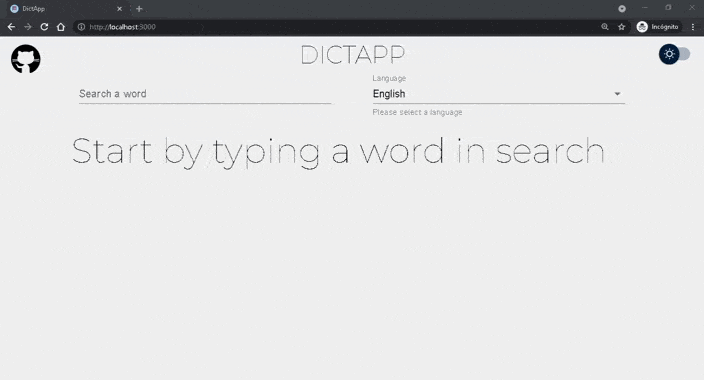
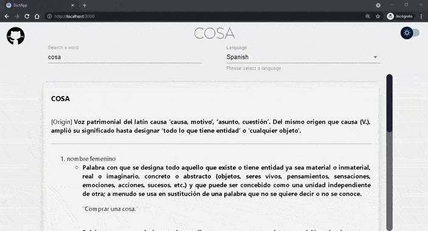

# DictApp

A [dictionary Progresive Web App](https://dictapp.netlify.app/)

## Demo



## Dark and Light Mode Support



## 🔨 Build with:

-   React
-   Axios
-   Material UI
-   Styled-Components
-   [Free Dictionary API](https://dictionaryapi.dev/)

I also made this app with Javascript, HTML and CSS [here](https://safjkib2pr.netlify.app/).

<!-- Installation -->

## ⚙ Installation

1. Clone repository

```sh
git clone https://github.com/ulysses-ck/dictapp-react
cd dictapp-react
```

2. Install dependencies

```sh
yarn install
```

3. Init app

```sh
yarn start
```

4. Build for production

```sh
yarn build
```

<!-- CONTRIBUTING -->

## 🤝 Contributing

Contributions are what make the open source community such an amazing place to learn, inspire, and create. Any contributions you make are **greatly appreciated**.

If you have a suggestion that would make this better, please fork the repo and create a pull request. You can also simply open an issue with the tag "enhancement".
Don't forget to give the project a star! Thanks again!

1. Fork the Project
2. Create your Feature Branch (`git checkout -b feature/AmazingFeature`)
3. Commit your Changes (`git commit -m 'Add some AmazingFeature'`)
4. Push to the Branch (`git push origin feature/AmazingFeature`)
5. Open a Pull Request

<!-- LICENSE -->

## ⚠ License

Distributed under the MIT License. See `LICENSE` for more information.
